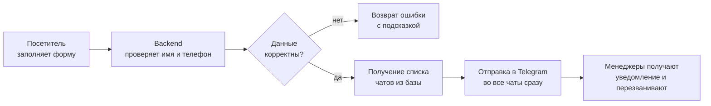

# Комтранссервис — сайт автосервиса

Лендинг для компании по ремонту и обслуживанию **коммерческого транспорта** (микроавтобусы и фургоны) в Санкт-Петербурге. Посетитель знакомится с услугами и модельным рядом, который обслуживает сервис, и оставляет **заявку на обратный звонок** — заявка мгновенно прилетает менеджерам в Telegram.

🌐 **Сайт в работе:** [komtransservice-spb.ru](https://komtransservice-spb.ru)

---

## Что это и для кого

Это не «визитка-картинка», а рабочий инструмент привлечения клиентов:

- посетитель видит, **что именно ремонтирует сервис** (модельный ряд), и проникается доверием (реальные фото цеха, прозрачные сроки);
- в один клик оставляет имя и телефон → менеджер сразу получает уведомление в Telegram и перезванивает;
- никакой «панели администратора» и базы клиентов не требуется — всё максимально просто и надёжно.

## Что получает заказчик

| Возможность | Описание |
|---|---|
| 📱 **Адаптивный сайт** | Корректно выглядит на телефоне, планшете и компьютере |
| 🌗 **Светлая и тёмная темы** | Переключаются вручную, запоминают выбор |
| 🚐 **Каталог модельного ряда** | Список обслуживаемых микроавтобусов с фильтром и двумя видами отображения |
| 📝 **Заявка на звонок** | Простая форма; заявки приходят в Telegram **в несколько чатов сразу** |
| 🛡️ **Защита от спама** | Ограничение частоты заявок с одного адреса |
| 🗺️ **Контакты и карта** | Телефоны, почта, адрес и интерактивная Яндекс.Карта |
| 🔒 **Приватность** | Заявки **нигде не хранятся** — только пересылаются в Telegram |
| 🚀 **Авто-обновление** | Изменения на сайте публикуются автоматически после внесения правок |

## Страницы сайта

| Страница | Адрес | Назначение |
|---|---|---|
| Главная | `/` | Презентация сервиса, ключевые цифры, призыв оставить заявку |
| Микроавтобусы | `/vans` | Модельный ряд, который обслуживает сервис (карточки / список) |
| О компании | `/info` | Преимущества, как проходит ремонт, фото цеха |
| Контакты | `/contacts` | Телефоны, почта, адрес, карта проезда |
| Запись | `/appointments` | Форма заявки на обратный звонок |

---

## Как устроен проект (архитектура)

Проект состоит из трёх независимых частей. Такое разделение упрощает поддержку: можно менять интерфейс, не трогая логику уведомлений, и наоборот.

```
┌──────────────────────────────────────────────────────────────┐
│                        ПОСЕТИТЕЛЬ САЙТА                        │
└───────────────────────────────┬──────────────────────────────┘
                                 │  открывает сайт, оставляет заявку
                                 ▼
        ┌─────────────────────────────────────────────┐
        │  FRONTEND — сам сайт (то, что видит человек)  │
        │  React + TypeScript + Vite                    │
        └───────────────────────────┬─────────────────┘
                                     │  отправляет заявку (имя, телефон)
                                     ▼
        ┌─────────────────────────────────────────────┐
        │  BACKEND — приёмник заявок                    │
        │  Express + TypeScript                         │
        │  • проверяет данные  • защита от спама        │
        └───────────┬───────────────────┬──────────────┘
                    │                   │
       читает чаты  ▼                   ▼  отправляет сообщение
        ┌────────────────────┐   ┌─────────────────────────┐
        │  DATABASE (SQLite)  │   │   Telegram-бот → чаты    │
        │  список Telegram-   │   │   менеджеров             │
        │  чатов для рассылки │   │                          │
        └────────────────────┘   └─────────────────────────┘
```

### Путь заявки (по шагам)



> Заявка считается успешной, если её получил **хотя бы один** чат — поэтому сбой одного менеджера не теряет заявку.

---

## Технологии

| Слой | Технологии | Зачем |
|---|---|---|
| **Frontend** | React 19, TypeScript, Vite | Быстрый, современный и поддерживаемый интерфейс |
| **Backend** | Node.js, Express, TypeScript | Лёгкий и надёжный приёмник заявок |
| **База данных** | SQLite | Хранит только список Telegram-чатов для рассылки |
| **Уведомления** | Telegram Bot API | Мгновенная доставка заявок менеджерам |
| **Веб-сервер** | nginx | Раздача сайта, HTTPS-сертификат |
| **Процессы** | pm2 | Автозапуск и перезапуск сервисов на сервере |
| **CI/CD** | GitHub Actions | Автоматическая проверка и публикация обновлений |

## Структура репозитория

```
kts-landing-page/
├── frontend/        # Сайт (React + Vite)
│   ├── src/
│   │   ├── pages/       # Страницы: Home, Vans, Info, Contacts, Appointments
│   │   ├── components/  # Переиспользуемые блоки (шапка, подвал, карточки, кнопки)
│   │   ├── data/        # Контент: список моделей, контакты
│   │   └── assets/      # Стили и дизайн-система (тема, шрифты, цвета)
│   └── public/photos/   # Реальные фотографии цеха
├── backend/         # API приёма заявок (Express)
│   ├── routes/ controllers/ services/ middleware/
│   └── services/telegram-service.ts   # Отправка в Telegram
├── database/        # Доступ к SQLite (список чатов)
├── .github/workflows/  # Автоматический деплой
└── README.md
```

---

## Дизайн

Единый визуальный стиль на всех страницах — «инженерная точность сервисного цеха»:

- фирменный красный акцент на графитово-светлой палитре;
- современная типографика (семейство IBM Plex);
- аккуратные карточки, читаемые цифры-показатели, статусные индикаторы;
- продуманная адаптивность и поддержка тёмной темы.

Все цвета, шрифты и отступы вынесены в единую **дизайн-систему** (`frontend/src/assets/theme`), поэтому при необходимости перекрасить сайт или сменить акцент можно централизованно.

## Развёртывание и обновления

Сайт размещён на собственном сервере под управлением nginx (HTTPS) и pm2.

Обновление происходит **автоматически**: после внесения изменений в основную ветку проекта GitHub Actions проверяет сборку и публикует новую версию на сервер. Откат к предыдущей версии возможен в любой момент.

- **Backend** работает на внутреннем порту и принимает заявки по адресу `/api/send-request`.
- **Проверка работоспособности:** `/health` (отвечает `OK`, если сервис жив).
- **Секреты** (токен Telegram-бота, идентификаторы чатов) хранятся только на сервере и **никогда не попадают в репозиторий**.

## Локальный запуск (для разработчика)

Требуется Node.js 18+.

```bash
# 1. Установить зависимости во всех трёх пакетах
make install            # или вручную: npm install в frontend, backend, database

# 2. Запустить backend (порт 5001)
cd backend && npm run dev

# 3. Запустить frontend (порт 3000)
cd frontend && npm run dev
```

Сайт откроется на `http://localhost:3000` и сам перенаправит запросы заявок на backend (`http://localhost:5001`).

Для работы уведомлений нужен файл `backend/.env` с токеном Telegram-бота и идентификаторами чатов (выдаётся отдельно, в репозиторий не коммитится).

---

<sub>Подробные технические заметки для сопровождения — в файлах `CLAUDE.md` и `DEPLOYMENT.md`.</sub>
